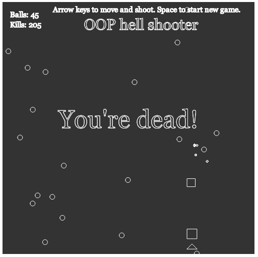

## OOP-hell-shooter
Little bullet hell game suddenly appeared while learning OOP.

Inspiration goes out to Bob Ross incarnated as a [train whistle operator](https://github.com/CodingTrain), especially his fireworks challenge.
Without it I couldn't have figured out how to make those amazing explosions.

Play the game [here](https://fraasi.github.io/OOP-hell-shooter/)

Left and right arrow keys to move, up arrow to shoot and space to start a new game.

